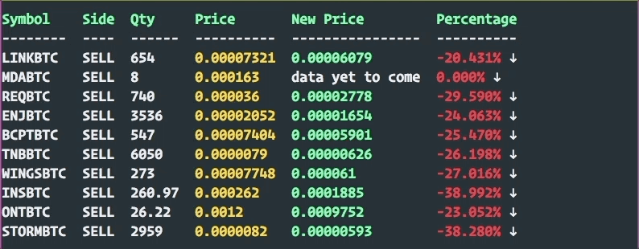
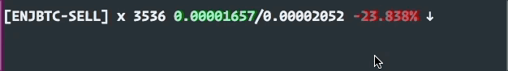

# Command line version of Binance

# Setup
run `atcb config`
* specify the *apiKey* and *secret* for accessing the full feature. 
* optionally setup push notification

# Commands

* balance   => provides balance data
* trade     => gets trade and order info
* subscribe => uses websocket to monitor selected symbols
* config    => setups api access to Binance and configure Push notification
* symbol    => provides supported symbols
* help      => provides help
* version   => prints version
* openOrder => interacts with open orders
* buy       => buys cryptos 👍
* sell      => sell cryptos

### Symbol 
* `atcb symbol --stat --openOrder` => print stats for all the open orders

* `atcb symbol --stat --pair=ENJBTC` => print stats for a specific symbol pair

### Balance

* `atcb balance --symbol=ADA` => print the current owning of ADA in form of
    available/onOrder
* `atcb balance --summary --hideSmall` => print out overview of your balance

* `atcb balance --summary --hideSmall --quoteAsset=ETH` => convert your balance
    to ETH

### Trade
* `atcb trade --symbol=ENJBTC --estimateProfit --orderId` => interactively see
    an order's status.

### Open Orders
* `atcb openOrder` => will print all your open orders with their performances

* `atcb openOrder --live` will open a websocket to update the table in real time

* `atcb openOrder --live --mode=oneline` => offers oneline mode

* `atcb openOrder --live --mode=concise` => there is also a concise mode, can
    be for example integrated into your tmux status line

### Sell
* `atcb sell --pair=MDABTC --price="130%" --qty="100%"` Place a limit order
    with all your MDA, with 130% of current market price

### Buy
* `atcb buy` => will start an interactive buy session

## TODOs
* [x] add monitor command, let use repeatly add order Id to moniter, use
    websocket if possible
* [ ] design a plugin/event system, websocket emit data, mutiple listners
    receive events
* [ ] prepare to open source ↑
* [ ] analyse candlestick
* [ ] run algorithm again historical data
* [ ] filter live by symbol ↓
* [ ] live -> one line verson ↓
* [x] ⌐ interactively choose order id via multiselect
* [x]   display win/loose on order/trade
* [ ] ⌙ handle exception not finding the order
* [x] ⌐ estimate balance in BTC
* [x] ⌙ nicely layout it's contribution
* [-] expose `help` in command interface, run command without args will show help section
* [ ] handle error in api module
* [ ] add account info ↡
